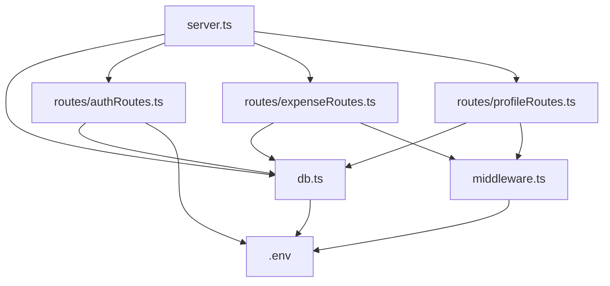

# FinTrack Backend - Technical Documentation & Code Explanation

This repository contains the backend REST API for **FinTrack (Expense Tracker)** built using **Node.js, Express.js, TypeScript, Mongoose (MongoDB), Zod (Validation), JWT (Authentication), and bcryptjs**.

---

## 📂 File Structure & Dependency Tree

### Directory Map
```text
FintrackBE/
├── .env                  # Confidential environment variables
├── package.json          # Node dependencies & npm scripts
├── tsconfig.json         # TypeScript compiler configuration
└── src/
    ├── db.ts             # Mongoose schemas, models & DB connection handler
    ├── middleware.ts     # JWT AuthMiddleware for protected route access
    ├── server.ts         # Main Express app entry point & route registration
    └── routes/
        ├── authRoutes.ts    # POST /api/auth/register, POST /api/auth/login
        ├── expenseRoutes.ts # GET, POST, PUT, DELETE /api/expenses
        └── profileRoutes.ts # GET, PUT /api/profile
```

### 🔗 Inter-File Linking & Dependencies



1. **`src/server.ts`** imports:
   - `databaseConnection` from `./db`
   - `authRoutes` from `./routes/authRoutes`
   - `expenseRoutes` from `./routes/expenseRoutes`
   - `profileRoutes` from `./routes/profileRoutes`
2. **`src/routes/authRoutes.ts`** imports:
   - `userModel` from `../db`
3. **`src/routes/expenseRoutes.ts`** imports:
   - `expenseModel` from `../db`
   - `AuthMiddleware` & `AuthRequest` from `../middleware`
4. **`src/routes/profileRoutes.ts`** imports:
   - `userModel`, `expenseModel` from `../db`
   - `AuthMiddleware` & `AuthRequest` from `../middleware`
5. **`src/middleware.ts`** & **`src/db.ts`** read environment variables (`databaseURL`, `userJWTpass`, `PORT`) from **`.env`**.

---

## 🔍 Detailed File & Code Explanations

### 1. `.env`
- **Purpose**: Stores confidential application settings.
- **Keys**:
  - `PORT=5000`: Port number Express server runs on.
  - `databaseURL`: MongoDB Atlas / local MongoDB connection string.
  - `userJWTpass`: Secret key used to sign and verify JWT authentication tokens.

### 2. `src/db.ts`
- **Purpose**: Defines MongoDB Mongoose schemas (`userSchema`, `expenseSchema`), exports compiled models (`userModel`, `expenseModel`), and exports `databaseConnection()`.
- **Key Features**:
  - Sets Node.js DNS order to `ipv4first` and configures fallback DNS (`8.8.8.8`, `1.1.1.1`) to prevent Windows `querySrv ECONNREFUSED` issues with MongoDB Atlas `mongodb+srv://` links.
  - `userSchema`: Fields `name`, `email` (lowercase, unique), `password` (hashed).
  - `expenseSchema`: Fields `userId` (ref User), `title`, `amount`, `category`, `date`, `notes`.
  - `databaseConnection()`: Promise wrapper connecting via `mongoose.connect()`, logging `"dataBase is Connected"`.

### 3. `src/middleware.ts`
- **Purpose**: Provides `AuthMiddleware` to protect private REST API routes.
- **Logic**:
  1. Extracts Authorization token from `req.headers["authorization"]` (supports both `Bearer <token>` and raw token string).
  2. Verifies token using `jwt.verify(token, userJWTpass)`.
  3. Attaches `req.userId` and `req.user = { id: decoded.id }` to the request object and calls `next()`.
  4. Returns HTTP 403 JSON response if token is missing or invalid.

### 4. `src/routes/authRoutes.ts`
- **Purpose**: Handles user authentication endpoints.
- **Endpoints**:
  - **`POST /api/auth/register`**:
    - Uses Zod schema (`z.object({...})`) to validate `name`, `email`, and `password`.
    - Returns HTTP 400 with field-specific errors if validation fails.
    - Checks `userModel.findOne({ email })` to prevent duplicates (HTTP 409).
    - Hashes password using `bcrypt.hash(password, 10)`.
    - Creates new user in MongoDB and signs a JWT token returning `{ token, user }`.
  - **`POST /api/auth/login`**:
    - Validates email & password input using Zod.
    - Finds user by email and compares password using `bcrypt.compare()`.
    - Issues JWT token returning `{ token, user }`.

### 5. `src/routes/expenseRoutes.ts`
- **Purpose**: Handles CRUD operations for expenses.
- **Protection**: Secured with `AuthMiddleware`.
- **Endpoints**:
  - **`GET /api/expenses`**: Fetches user's expenses sorted by date descending. Supports search filter (`search` query) and category filter (`category` query).
  - **`POST /api/expenses`**: Validates `title`, `amount`, `category`, `date`, `notes` using Zod schema and creates expense linked to `req.userId`.
  - **`PUT /api/expenses/:id`**: Validates fields with Zod, checks ownership, and updates the targeted expense.
  - **`DELETE /api/expenses/:id`**: Deletes the specified expense owned by `req.userId`.

### 6. `src/routes/profileRoutes.ts`
- **Purpose**: Manages user profile information and lifetime spending statistics.
- **Protection**: Secured with `AuthMiddleware`.
- **Endpoints**:
  - **`GET /api/profile`**: Returns user profile details alongside MongoDB aggregation stats (`totalExpensesCount` and `totalAmountSpent`).
  - **`PUT /api/profile`**: Validates name/email/password with Zod. Supports updating user's display name, email, or changing password (verifies `currentPassword` with bcrypt before updating).

### 7. `src/server.ts`
- **Purpose**: Entry point of the Node.js application.
- **Logic**:
  - Configures `dotenv.config()`.
  - Calls `databaseConnection()`.
  - Mounts CORS middleware (`app.use(cors())`) and JSON body parser (`app.use(express.json())`).
  - Mounts router modules at `/api/auth`, `/api/expenses`, `/api/profile`.
  - Health check endpoint `GET /` returning `{ message: "FinTrack Backend Running 🚀" }`.
  - Listens on `PORT=5000`.

---

## ⚙️ How to Run

1. Install dependencies:
   ```bash
   npm install
   ```
2. Build TypeScript code:
   ```bash
   npm run build
   ```
3. Start development server:
   ```bash
   npm run dev
   ```
